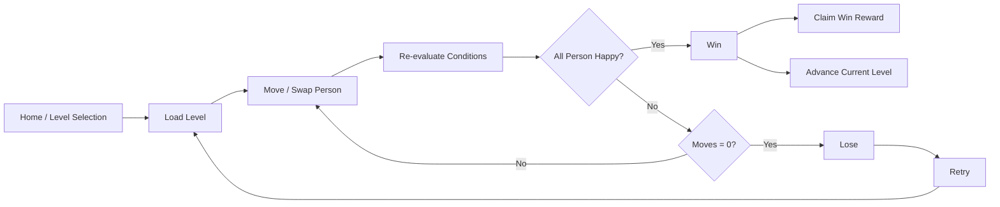
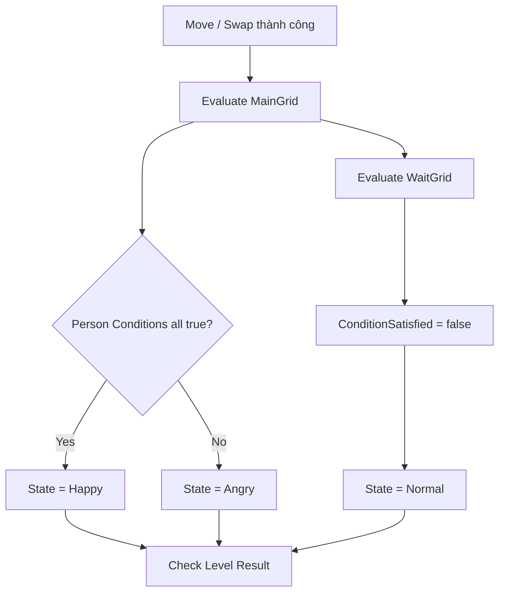
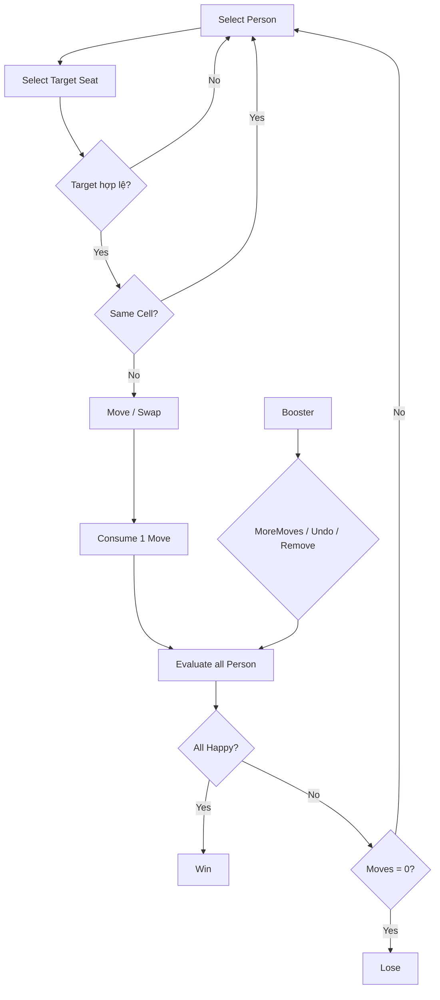

# **WannaSitHere — Game Design Document**

  

> **Phạm vi tài liệu:** Tài liệu này mô tả gameplay và meta-system đang tồn tại trong project `WannaSitHere-Refactor` tại thời điểm rà soát. Nội dung từ GDD mẫu chỉ được dùng làm **pattern trình bày và convention**, không được mặc định là feature của project hiện tại. Những hệ thống không tồn tại trong runtime hiện tại, như Star Rating hoặc IAP Shop, không được đưa vào như rule chính thức.

  

# **Mục lục**

  

- [**1. Game Overview**](#1-game-overview)

- [**2. Game Elements**](#2-game-elements)

  - [2.1. Person](#21-person)

  - [2.2. Food](#22-food)

  - [2.3. Grid & Cell](#23-grid--cell)

  - [2.4. Conditions](#24-conditions)

  - [2.5. Boosters](#25-boosters)

- [**3. Core Mechanics**](#3-core-mechanics)

  - [3.1. Moves](#31-moves)

  - [3.2. MainGrid & WaitGrid](#32-maingrid--waitgrid)

  - [3.3. Person State](#33-person-state)

  - [3.4. Condition Evaluation](#34-condition-evaluation)

  - [3.5. Win / Lose](#35-win--lose)

  - [3.6. InGame Loop](#36-ingame-loop)

- [**4. Levels**](#4-levels)

  - [4.1. Level Structure](#41-level-structure)

  - [4.2. Level Person Config](#42-level-person-config)

  - [4.3. Level Authoring Rules](#43-level-authoring-rules)

  - [4.4. Level 1 — Current Example](#44-level-1--current-example)

- [**5. Progression**](#5-progression)

  - [5.1. Level Progression](#51-level-progression)

  - [5.2. Player Progress Data](#52-player-progress-data)

  - [5.3. Current Progression Limitations](#53-current-progression-limitations)

- [**6. Economy**](#6-economy)

  - [6.1. Inventory & Currencies](#61-inventory--currencies)

  - [6.2. Level Reward](#62-level-reward)

  - [6.3. Shop](#63-shop)

  - [6.4. Login Reward](#64-login-reward)

  

---

  

# **1. Game Overview**

  

**Name:** WannaSitHere

  

**Genre:** Puzzle, Casual

  

**Platforms:** Android, iOS

  

**Pitch:**  

Một game puzzle casual nơi người chơi sắp xếp các **Person** vào những **Seat** phù hợp. Mỗi Person có một **Trait** và tối đa hai **Condition** dạng Like/Hate đối với Person Trait hoặc Food ở các ô liền kề. Người chơi có thể di chuyển hoặc hoán đổi Person giữa **MainGrid** và **WaitGrid** trong giới hạn số Moves. Mục tiêu là đưa toàn bộ Person về trạng thái **Happy** trước khi hết Moves.

  

**Core Loop:**

  



  

**Core Design Pillars:**

  

| Pillar | Ý nghĩa |

|---|---|

| **Spatial Reasoning** | Đọc quan hệ 4-kề giữa Person, Food và Seat để tìm vị trí hợp lệ. |

| **Constraint Satisfaction** | Mỗi Person chỉ Happy khi toàn bộ Condition của họ được thỏa mãn đồng thời. |

| **Move Management** | Mỗi lần di chuyển hoặc swap hợp lệ tiêu tốn 1 Move; người chơi phải hoàn thành level trước khi budget về 0. |

| **Temporary Buffering** | WaitGrid cho phép giữ Person tạm thời, nhưng Person ở WaitGrid không thể Happy và do đó không thể còn ở WaitGrid khi thắng. |

  

---

  

# **2. Game Elements**

  

## **2.1. Person**

  

Mỗi **Person** là một nhân vật có Trait riêng và một danh sách Condition. Person là đối tượng chính mà người chơi di chuyển giữa các Seat.

  

**Cấu trúc gameplay của một Person:**

  

```text

Person {

    PersonName,

    Trait,

    State: Normal / Angry / Happy,

    Conditions[],

    ConditionSatisfied[],

    BaseSprite

}

```

  

**Trong đó:**

  

| Thuộc tính | Ý nghĩa |

|---|---|

| **PersonName** | Tên hiển thị của Person. |

| **Trait** | Trait gameplay của Person. |

| **State** | Trạng thái feedback hiện tại: Normal, Angry hoặc Happy. |

| **Conditions[]** | Các Condition mà Person phải thỏa mãn. |

| **ConditionSatisfied[]** | Trạng thái true/false tương ứng với từng Condition. |

| **BaseSprite** | Sprite cơ sở của Person. |

  

**Person Trait hiện có:**

  

| Trait | Giá trị |

|---|---:|

| Cool | 0 |

| Sick | 1 |

| Dirty | 2 |

| Loud | 3 |

| Quiet | 4 |

  

Trait được dùng làm target cho các Person Condition. Condition hiện tại **không target một Person cụ thể theo tên**, mà target theo Trait.

  

---

  

## **2.2. Food**

  

**Food** không phải một entity di chuyển độc lập. Food là dữ liệu nằm trên một Cell có `CellType = Food` trong MainGrid.

  

```text

Food {

    Hamburger,

    FrenchFries,

    Any

}

```

  

| Food | Vai trò |

|---|---|

| **Hamburger** | Food cụ thể có thể được Like/Hate. |

| **FrenchFries** | Food cụ thể có thể được Like/Hate. |

| **Any** | Giá trị đặc biệt dùng cho Condition `Like Food Any`, được hệ thống hiểu là **CanSitAnywhere**. |

  

Food Cell là static obstacle về mặt placement: Person không thể được đặt lên Cell loại Food.

  

---

  

## **2.3. Grid & Cell**

  

Mỗi level có hai Grid độc lập:

  

1. **MainGrid:** Board chính nơi Condition được đánh giá.

2. **WaitGrid:** Khu vực giữ Person tạm thời.

  

### **Grid**

  

```text

Grid {

    GridSize,

    CellSize,

    CellDistance,

    PositionX,

    PositionY,

    Cell[]

}

```

  

| Thuộc tính | Ý nghĩa |

|---|---|

| **GridSize** | Kích thước `(width, height)` của Grid. |

| **CellSize** | Kích thước hiển thị của Cell. |

| **CellDistance** | Khoảng cách giữa các Cell. |

| **PositionX / PositionY** | Vị trí tương đối của Grid trên viewport. |

| **Cell[]** | Danh sách Cell của Grid. |

  

### **Cell**

  

```text

Cell {

    Index(x, y),

    OwnGrid: MainGrid / WaitGrid,

    Type: Seat / Food / Block,

    Food,

    CurrentPerson

}

```

  

| CellType | Chứa Person | Ý nghĩa |

|---|---:|---|

| **Seat** | Có | Cell hợp lệ để Person đứng/ngồi. |

| **Food** | Không | Cell cố định chứa Food. |

| **Block** | Không | Cell không thể đặt Person. |

  

### **Adjacency**

  

Gameplay hiện tại xét **4 hướng cardinal**:

  

```text

Up

Down

Left

Right

```

  

Không xét diagonal.

  

Một Person trên MainGrid chỉ kiểm tra Condition với các Cell cardinal-adjacent trong **MainGrid**.

  

> **Lưu ý:** Khái niệm adjacency dùng để kiểm tra Condition, **không** giới hạn phạm vi Move. Person có thể được kéo tới bất kỳ Seat hợp lệ nào, không cần target nằm cạnh source.

  

---

  

## **2.4. Conditions**

  

Condition hiện tại được mô hình hóa bằng hai trục:

  

- **Type:** `Like` hoặc `Hate`

- **Target:** `Person` hoặc `Food`

  

```text

Condition {

    Type: Like / Hate,

    Target: Person / Food,

  

    TargetTrait,   // dùng khi Target = Person

    FoodTarget,    // dùng khi Target = Food

  

    Description,

    AngryDescription

}

```

  

### **Condition Types**

  

| Type | Rule |

|---|---|

| **Like** | Thỏa mãn nếu có **ít nhất một** adjacent Cell match target. |

| **Hate** | Thỏa mãn nếu **không có** adjacent Cell nào match target. |

  

### **Condition Targets**

  

| Target | Cách match |

|---|---|

| **Person** | Adjacent Cell phải là Seat, đang có Person và Person đó có đúng `TargetTrait`. |

| **Food** | Adjacent Cell phải là Food và có đúng `FoodTarget`. |

  

### **Special Condition — CanSitAnywhere**

  

```text

Type       = Like

Target     = Food

FoodTarget = Any

```

  

Condition này luôn trả về `true`, không phụ thuộc vị trí của Person.

  

### **Ví dụ**

  

| Mô tả | Condition |

|---|---|

| Cooly ghét ngồi cạnh người Cool | `Hate + Person + Cool` |

| Person thích ngồi cạnh người Quiet | `Like + Person + Quiet` |

| Person ghét Hamburger | `Hate + Food + Hamburger` |

| Person thích French Fries | `Like + Food + FrenchFries` |

| Person có thể ngồi ở bất kỳ đâu | `Like + Food + Any` |

  

### **Giới hạn authoring hiện tại**

  

Mỗi Person occurrence trong một Level được phép có tối đa:

  

```text

MAX_CONDITION_PER_PERSON = 2

```

  

Đây là constraint của dữ liệu level hiện tại.

  

---

  

## **2.5. Boosters**

  

Project hiện có ba Booster:

  

| Booster | Tác dụng thực tế |

|---|---|

| **MoreMoves** | Cộng thêm `MORE_MOVE_AMOUNT = 3` vào số Moves còn lại. |

| **Undo** | Hoàn tác Move gần nhất có trong `MoveHistory` và hoàn lại 1 Move. |

| **Remove** | Chọn ngẫu nhiên một Person hợp lệ theo priority và thay toàn bộ Condition của Person đó bằng `CanSitAnywhere`. |

  

### **MoreMoves**

  

```text

CurrentMove += 3

```

  

Booster chỉ dùng được khi:

  

- Level đang tồn tại.

- Level chưa hết Moves.

- Inventory có ít nhất 1 `MoreMoves`.

  

Mỗi lần dùng tiêu tốn 1 unit `MoreMoves` trong Inventory.

  

### **Undo**

  

Undo sử dụng `MoveHistory`.

  

Khi thành công:

  

1. Person đã di chuyển trở về Source Cell.

2. Person bị swap, nếu có, trở về Target Cell.

3. `CurrentMove += 1`.

4. 1 unit `Undo` bị trừ khỏi Inventory.

5. Condition được evaluate lại sau khi view hoàn tác.

  

**Current implementation:** Move `WaitGrid → WaitGrid` không được record vào MoveHistory, nên không thể Undo bằng booster.

  

### **Remove**

  

Target selection hiện tại:

  

1. Tìm ngẫu nhiên một **Angry Person trên MainGrid** chưa có `CanSitAnywhere`.

2. Nếu không có, tìm ngẫu nhiên một **Person trên WaitGrid** còn Condition và chưa có `CanSitAnywhere`.

3. Nếu không có target hợp lệ → Booster không được dùng.

  

Khi thành công:

  

```text

TargetPerson.Conditions = [CanSitAnywhere]

```

  

Booster không cho người chơi chọn target thủ công trong implementation hiện tại.

  

---

  

# **3. Core Mechanics**

  

## **3.1. Moves**

  

Một **Move** là một lần thay đổi vị trí Person thành công giữa các Seat.

  

| Thao tác | Điều kiện | Move Cost | Ghi chú |

|---|---|---:|---|

| **Move to Empty Seat** | Target là Seat trống | 1 | Person chuyển từ Source sang Target. |

| **Swap** | Target là Seat có Person khác | 1 | Hai Person đổi Cell cho nhau. |

| **Drop on Same Cell** | Source = Target | 0 | Không thay đổi board, không giảm Moves. |

| **Move to Food** | Target = Food | Không hợp lệ | Không thay đổi state. |

| **Move to Block** | Target = Block | Không hợp lệ | Không thay đổi state. |

| **Wait → Wait** | Source và Target đều thuộc WaitGrid | 1 | Hợp lệ nhưng không được ghi vào Undo history. |

  

### **Move Range**

  

Move không phụ thuộc khoảng cách hình học.

  

Nếu Target là Seat hợp lệ thì Person có thể được Move/Swap trực tiếp tới Target, kể cả khi Source và Target không adjacent.

  

### **Move History**

  

Move được record khi:

  

```text

Source Cell tồn tại

AND

không phải WaitGrid → WaitGrid

```

  

MoveHistory phục vụ riêng cho Undo Booster.

  

---

  

## **3.2. MainGrid & WaitGrid**

  

### **MainGrid**

  

MainGrid là vùng gameplay chính:

  

- Chứa Seat, Food và Block.

- Person trên MainGrid được evaluate Condition theo 4-kề.

- Person có thể trở thành Happy hoặc Angry.

- Goal cuối cùng yêu cầu mọi Person trên board đều Happy.

  

### **WaitGrid**

  

WaitGrid là vùng buffer:

  

- Chỉ dùng để giữ/di chuyển Person tạm thời.

- Person ở WaitGrid luôn được set về `Normal`.

- Mọi Condition của Person ở WaitGrid được đánh dấu `false`.

- Condition không được evaluate dựa trên adjacency trong WaitGrid.

  

Do đó:

  

> Nếu WaitGrid còn bất kỳ Person nào thì Level chưa thể thắng.

  

WaitGrid không phải một “safe solved area”; nó chỉ là buffer hỗ trợ sắp xếp.

  

---

  

## **3.3. Person State**

  

Person có ba trạng thái:

  

```text

Normal

Angry

Happy

```

  

| State | Điều kiện |

|---|---|

| **Normal** | Person đang ở WaitGrid. |

| **Angry** | Person đang ở MainGrid nhưng có ít nhất một Condition không thỏa mãn. |

| **Happy** | Person đang ở MainGrid và toàn bộ Condition đều thỏa mãn. |

  

Với Person không có Condition và đang ở MainGrid:

  

```text

All Conditions Satisfied = true

→ State = Happy

```

  

Đây cũng là lý do `CanSitAnywhere` có thể làm target của Remove Booster trở nên không còn bị ràng buộc bởi vị trí.

  

---

  

## **3.4. Condition Evaluation**

  

Sau mỗi Move thành công, toàn bộ Person được evaluate lại.

  

### **Evaluation Flow**

  



  

### **Like**

  

Với một Condition Like:

  

```text

Satisfied = tồn tại ít nhất 1 adjacent Cell match target

```

  

### **Hate**

  

Với một Condition Hate:

  

```text

Satisfied = không tồn tại adjacent Cell nào match target

```

  

### **CanSitAnywhere**

  

```text

Like + Food + Any

```

  

luôn được xem là satisfied.

  

---

  

## **3.5. Win / Lose**

  

### **Win**

  

Level thắng khi:

  

```text

All Person State == Happy

```

  

Điều này được kiểm tra trên cả MainGrid và WaitGrid.

  

Vì Person ở WaitGrid luôn `Normal`, điều kiện trên tương đương với:

  

```text

Không còn Person trong WaitGrid

AND

mọi Person trên MainGrid đều Happy

```

  

### **Lose**

  

Nếu chưa thỏa Win và:

  

```text

CurrentMove == 0

```

  

Level thua.

  

### **Priority khi Move cuối cùng**

  

Sau mỗi Move:

  

1. Evaluate toàn bộ Person.

2. Check Win trước.

3. Nếu chưa Win mới check `IsOutOfMove`.

  

Vì vậy nếu Move cuối cùng làm toàn bộ Person Happy khi Moves vừa về 0:

  

```text

Result = Win

```

  

---

  

## **3.6. InGame Loop**

  



  

---

  

# **4. Levels**

  

## **4.1. Level Structure**

  

Level được author bằng `LevelDataSO`.

  

```text

Level {

    LevelMove,

    MainGrid,

    WaitGrid,

    PersonConfigs[],

    LevelEnvironmentPrefabs[]

}

```

  

**Trong đó:**

  

| Thuộc tính | Ý nghĩa |

|---|---|

| **LevelMove** | Số Moves ban đầu của Level. |

| **MainGrid** | Board chính. |

| **WaitGrid** | Buffer Grid. |

| **PersonConfigs[]** | Danh sách Person occurrence, Condition và vị trí ban đầu. |

| **LevelEnvironmentPrefabs[]** | Các prefab môi trường được spawn cùng Level. |

  

Level không chứa Star threshold hoặc difficulty score trong data model hiện tại.

  

---

  

## **4.2. Level Person Config**

  

Mỗi Person occurrence trong Level có cấu hình riêng:

  

```text

LevelPersonConfig {

    Definition,

    Conditions[],

    GridId,

    Position

}

```

  

| Thuộc tính | Ý nghĩa |

|---|---|

| **Definition** | `PersonDefinitionSO` mô tả identity/visual/Trait của Person. |

| **Conditions[]** | Condition riêng của occurrence này trong Level. |

| **GridId** | Vị trí ban đầu thuộc MainGrid hay WaitGrid. |

| **Position** | Coordinate `(x, y)` trong Grid tương ứng. |

  

Cùng một `PersonDefinitionSO` có thể được sử dụng nhiều lần trong một Level. Mỗi occurrence có thể có danh sách Condition riêng.

  

---

  

## **4.3. Level Authoring Rules**

  

Level chỉ được convert sang runtime nếu validation thành công.

  

Các rule hiện tại:

  

| Rule | Validation |

|---|---|

| Person Config không được null | Bắt buộc |

| Person Definition không được null | Bắt buộc |

| Condition reference không được null | Bắt buộc |

| Condition count | `<= 2` |

| Person Position | Phải nằm trong bounds của Grid |

| Initial Cell | Phải là `Seat` |

| Duplicate placement | Không được có hai Person cùng một Cell |

| Target Grid | Phải tồn tại |

  

Nếu validation fail, Level không được load thành runtime data và grid hiện tại không bị thay thế.

  

---

  

## **4.4. Level 1 — Current Example**

  

Level 1 hiện tại là ví dụ đơn giản nhất cho core puzzle.

  

```text

LevelMove = 20

  

MainGrid:

    Size = 2 x 3

    4 Seat

    1 Hamburger

    1 FrenchFries

  

WaitGrid:

    Size = 2 x 1

  

Person:

    Cooly

    Start = WaitGrid (0, 0)

    Conditions:

        Hate Cool

        Hate Hamburger

```

  

Với layout hiện tại:

  

- Có 4 Seat trên MainGrid.

- Hai Seat nằm cạnh Hamburger không thỏa `Hate Hamburger`.

- Hai Seat còn lại an toàn.

- Chỉ cần 1 Move từ WaitGrid tới một Seat an toàn để thắng.

  

Level này thể hiện trực tiếp ba rule nền tảng:

  

1. Person trong WaitGrid chưa thể thắng.

2. Condition dùng adjacency 4-kề.

3. Người chơi có thể đưa Person trực tiếp từ WaitGrid tới bất kỳ Seat hợp lệ nào.

  

---

  

# **5. Progression**

  

## **5.1. Level Progression**

  

Progression hiện tại dùng một biến duy nhất:

  

```text

currentLevel

```

  

Giá trị mặc định của save mới:

  

```text

currentLevel = 1

```

  

Khi nhận Win event:

  

```text

currentLevel += 1

SaveGame()

```

  

Level loader lấy level từ danh sách `_levelData`.

  

**Current implementation detail:**

  

```text

index = (levelNumber - 1) % levelData.Count

```

  

Do đó nếu `currentLevel` vượt quá số Level được cấu hình, loader hiện tại sẽ quay vòng lại danh sách Level.

  

Đây là hành vi runtime hiện tại; nếu production design yêu cầu kết thúc chapter/game sau level cuối thì cần một rule khác.

  

---

  

## **5.2. Player Progress Data**

  

Save hiện tại được lưu dưới dạng JSON tại `Application.persistentDataPath/data.json`.

  

```text

GameData {

    currentLevel,

  

    currentGold,

    currentGem,

    currentRemove,

    currentMoreMoves,

    currentUndo,

  

    currentLoginDay,

    isDailyRewardClaimed,

    isWeeklyRewardClaimed,

    lastLoginDateUtc,

  

    goldShopPurchaseCountToday[],

  

    currentSoundVolume,

    isSoundMuted,

    currentMusicVolume,

    isMusicMuted

}

```

  

### **Gameplay / Progress fields**

  

| Field | Ý nghĩa |

|---|---|

| **currentLevel** | Level hiện tại của người chơi. |

| **currentGold** | Gold đang sở hữu. |

| **currentGem** | Gem đang sở hữu. |

| **currentRemove** | Số Remove booster trong Inventory. |

| **currentMoreMoves** | Số MoreMoves unit trong Inventory. |

| **currentUndo** | Số Undo booster trong Inventory. |

  

### **Daily / Economy fields**

  

| Field | Ý nghĩa |

|---|---|

| **currentLoginDay** | Index hiện tại trong chu kỳ Weekly Reward 7 ngày. |

| **isDailyRewardClaimed** | Daily Reward hôm nay đã claim chưa. |

| **isWeeklyRewardClaimed** | Weekly Reward tại currentLoginDay đã claim chưa. |

| **lastLoginDateUtc** | Ngày login gần nhất, lưu UTC. |

| **goldShopPurchaseCountToday[]** | Số lần mua từng Gold Shop slot trong ngày. |

  

---

  

## **5.3. Current Progression Limitations**

  

Các feature có trong GDD mẫu nhưng **không tồn tại trong progression model hiện tại**:

  

| Feature | Trạng thái trong project hiện tại |

|---|---|

| **Star Rating** | Không có trong LevelRuntimeData/GameData. |

| **Best Stars per Level** | Không lưu. |

| **HasClearedBefore** | Không lưu. |

| **Has3StarBefore** | Không lưu. |

| **Per-level completion record** | Không lưu. |

| **Explicit unlock history** | Không lưu; chỉ có `currentLevel`. |

  

Vì vậy progression hiện tại là **linear current-level progression**, chưa phải hệ thống record theo từng level như GDD mẫu.

  

---

  

# **6. Economy**

  

## **6.1. Inventory & Currencies**

  

Economy dùng chung `ItemType` cho Currency và Booster.

  

```text

ItemType {

    Gold,

    Gem,

    Remove,

    Undo,

    MoreMoves

}

```

  

Reward có cấu trúc:

  

```text

Reward {

    Type,

    Amount

}

```

  

### **Currencies**

  

| Currency | Vai trò hiện tại |

|---|---|

| **Gold** | Dùng làm cost cho các Gold Shop slot. |

| **Gem** | Dùng làm cost cho các Gem Shop slot. |

  

### **Booster Inventory**

  

| Item | Vai trò |

|---|---|

| **Remove** | Dùng Remove Booster. |

| **Undo** | Dùng Undo Booster. |

| **MoreMoves** | Dùng MoreMoves Booster. |

  

Inventory được persist cùng GameData.

  

---

  

## **6.2. Level Reward**

  

Economy config hiện tại có hai reward liên quan tới Win:

  

```text

EconomyConfig {

    levelWinReward,

    levelAdsWinReward,

    ...

}

```

  

### **Normal Win Reward**

  

Khi người chơi bấm claim reward:

  

```text

Inventory += levelWinReward

```

  

`levelWinReward` là **một Reward** gồm một `ItemType` và `Amount`, không phải công thức Gold/Gem dựa trên số sao.

  

### **Ads Win Reward**

  

Project có reward riêng:

  

```text

levelAdsWinReward

```

  

Khi event claim Ads Reward được kích hoạt:

  

```text

Inventory += levelAdsWinReward

```

  

Phần code gameplay/economy hiện tại chỉ xử lý việc grant Reward; cơ chế ads provider cụ thể không thuộc core rule này.

  

### **Win và Progression**

  

Win event hiện tại:

  

```text

Win

→ AdvanceLevel()

→ SaveGame()

```

  

Claim Win Reward là event riêng. Vì vậy **advance progression** và **claim reward** là hai action tách biệt trong implementation hiện tại.

  

---

  

## **6.3. Shop**

  

Shop hiện tại có hai nhóm purchase chính:

  

1. **Gold Shop**

2. **Gem Shop**

  

Không có IAP Section trong `EconomyConfigSO` hiện tại.

  

```text

EconomyConfig {

    GoldShopPrice[3],

    GoldShopLimit[3],

    GemShopPrice[3]

}

```

  

### **Purchase Rule**

  

```text

Purchase succeeds IF:

    Inventory has enough Cost

AND

    Gold Shop daily limit has not been reached (Gold Shop only)

```

  

Sau khi mua:

  

```text

Inventory -= Cost

Inventory += Item

```

  

### **Gold Shop**

  

- Có 3 slot.

- Mỗi slot có price riêng.

- Mỗi slot có daily purchase limit riêng.

- Purchase count được lưu trong save.

- Count reset khi sang ngày UTC mới.

  

### **Gem Shop**

  

- Có 3 price slot.

- Không truyền Gold Shop limit index vào transaction.

- Vì vậy không bị daily limit bởi `EconomyManager`.

  

### **Booster Purchase**

  

Shop hiện tại bán ba loại Booster:

  

```text

Remove

Undo

MoreMoves

```

  

Remove và Undo được grant `1` unit mỗi lần mua.

  

MoreMoves hiện được grant:

  

```text

Amount = MORE_MOVE_AMOUNT = 3

```

  

trong khi mỗi lần **sử dụng** MoreMoves chỉ spend `1` unit và cộng `+3 Moves`.

  

> **Implementation note:** Theo code hiện tại, mua một MoreMoves shop item sẽ thêm 3 unit `MoreMoves`, tương đương tối đa 3 lần sử dụng booster, mỗi lần +3 Moves. Nếu design intent là “mua 1 booster = dùng 1 lần”, phần grant amount này cần được chốt lại.

  

---

  

## **6.4. Login Reward**

  

Login Reward có hai track:

  

1. **Daily Reward**

2. **Weekly Reward 7 ngày**

  

```text

EconomyConfig {

    DailyReward,

    WeeklyReward[7]

}

```

  

### **Daily Reward**

  

- Mỗi calendar day UTC có thể claim 1 lần.

- Khi sang ngày mới, `isDailyRewardClaimed = false`.

- Reward chỉ được cộng khi người chơi thực hiện Claim event.

  

```text

CanClaimDaily = !isDailyRewardClaimed

```

  

### **Weekly Reward**

  

Weekly Reward dùng:

  

```text

currentLoginDay = 0..6

```

  

Mỗi index tương ứng một Reward trong `weeklyReward[7]`.

  

Rule hiện tại là **non-punishing cumulative cycle**:

  

- Nếu Weekly Reward hiện tại đã được claim, khi sang ngày UTC mới:

  - `currentLoginDay = (currentLoginDay + 1) % 7`

  - `isWeeklyRewardClaimed = false`

- Nếu reward hiện tại **chưa claim**, sang ngày mới không tăng `currentLoginDay`.

- Không có rule reset streak vì bỏ lỡ 1 hoặc nhiều ngày trong `EconomyManager` hiện tại.

  

Do đó Weekly track hoạt động gần với:

  

> Claim đủ 7 reward theo thứ tự; bỏ ngày không làm mất progression.

  

### **Gold Shop Daily Reset**

  

Khi sang ngày UTC mới:

  

```text

goldShopPurchaseCountToday[] = 0

```

  

Daily state cũng được kiểm tra lại khi app regain focus.

  

### **Clock Rollback**

  

Nếu:

  

```text

nowUtc.Date < lastLoginUtc.Date

```

  

Economy không coi đây là ngày mới và không reset daily state. Đây là guard cơ bản đối với clock rollback.

  

---

  

# **7. Current Design / Implementation Boundary**

  

Phần này không phải feature mới; đây là ranh giới để tránh GDD mô tả khác project thực tế.

  

| Nội dung | Trạng thái |

|---|---|

| 4-way adjacency | **Implemented** |

| Like/Hate Person Trait | **Implemented** |

| Like/Hate Food | **Implemented** |

| MainGrid + WaitGrid | **Implemented** |

| Normal / Angry / Happy | **Implemented** |

| MoreMoves / Undo / Remove | **Implemented** |

| Gold / Gem economy | **Implemented** |

| Gold/Gem Booster Shop | **Implemented** |

| Daily + cumulative Weekly Reward | **Implemented** |

| Linear `currentLevel` progression | **Implemented** |

| Star Rating | **Not implemented** |

| Per-level star/history records | **Not implemented** |

| IAP Shop | **Not represented in current economy config/runtime** |

| Generic Condition Scope/Comparator system | **Not implemented** |

| 8-direction adjacency | **Not used by current gameplay** |

| Difficulty Score / Difficulty Analyzer | **Not implemented in runtime** |

  

---

  

# **8. Naming & Documentation Convention**

  

Tài liệu sử dụng convention giống project:

  

- Tên entity/system/type giữ bằng **English**: `Person`, `Food`, `Grid`, `Condition`, `Booster`, `MainGrid`, `WaitGrid`.

- Rule và intent giải thích bằng **Vietnamese**.

- Tên enum/value giữ nguyên code khi có thể: `Happy`, `Angry`, `Hate`, `Like`, `FrenchFries`.

- Pseudo-structure mô tả **gameplay data contract**, không copy nguyên class implementation.

- Table được ưu tiên cho rule có tập giá trị hữu hạn.

- Flowchart được dùng cho loop hoặc state transition.

- Giá trị hard-coded/config hiện tại được ghi rõ bằng tên constant, ví dụ `MORE_MOVE_AMOUNT = 3`.

	- Hành vi implementation khác với design kỳ vọng được ghi dưới dạng **Implementation note**, không tự động sửa thành rule mong muốn.