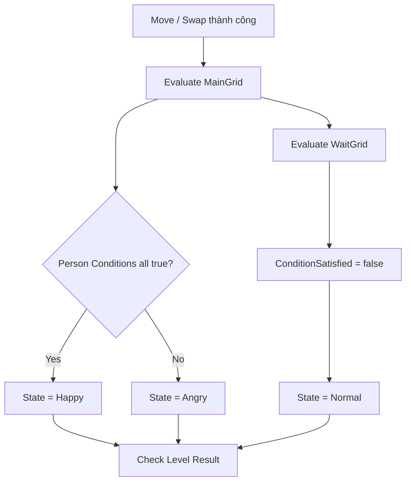
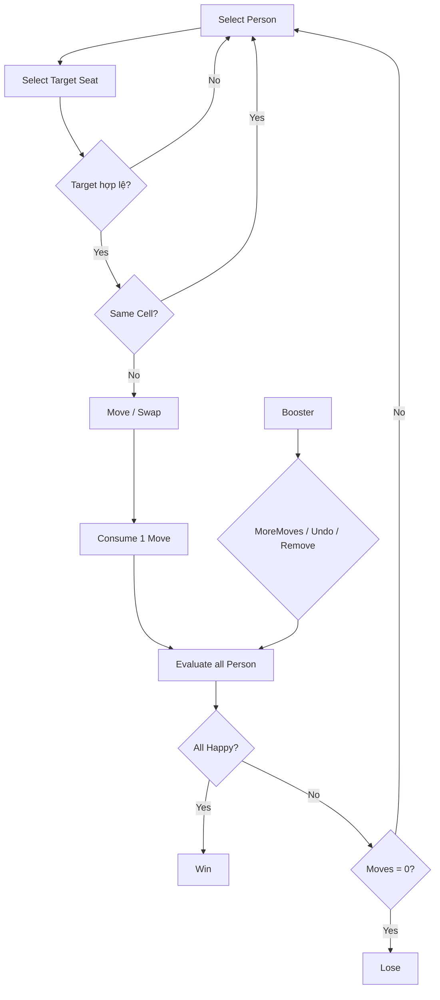

# **WannaSitHere — Game Design Document**

> **Phạm vi tài liệu:** Tài liệu này mô tả gameplay và meta-system đang tồn tại trong project `WannaSitHere-Refactor` tại thời điểm rà soát. Nội dung từ GDD mẫu chỉ được dùng làm **pattern trình bày và convention**, không được mặc định là feature của project hiện tại. Những hệ thống không tồn tại trong runtime hiện tại, như Star Rating hoặc IAP Shop, không được đưa vào như rule chính thức.

# **Mục lục**

- [**1. Game Overview**](#1-game-overview)
- [**2. Game Elements**](#2-game-elements)
  - [2.1. Person](#21-person)
  - [2.2. Food](#22-food)
  - [2.3. Grid & Cell](#23-grid--cell)
  - [2.4. Conditions](#24-conditions)
  - [2.5. Boosters](#25-boosters)
- [**3. Core Mechanics**](#3-core-mechanics)
  - [3.1. Moves](#31-moves)
  - [3.2. MainGrid & WaitGrid](#32-maingrid--waitgrid)
  - [3.3. Person State](#33-person-state)
  - [3.4. Condition Evaluation](#34-condition-evaluation)
  - [3.5. Win / Lose](#35-win--lose)
  - [3.6. InGame Loop](#36-ingame-loop)
- [**4. Levels**](#4-levels)
  - [4.1. Level Structure](#41-level-structure)
  - [4.2. Level Person Config](#42-level-person-config)
  - [4.3. Level Authoring Rules](#43-level-authoring-rules)
  - [4.4. Level 1 — Current Example](#44-level-1--current-example)
- [**5. Progression**](#5-progression)
  - [5.1. Level Progression](#51-level-progression)
  - [5.2. Player Progress Data](#52-player-progress-data)
  - [5.3. Current Progression Limitations](#53-current-progression-limitations)
- [**6. Economy**](#6-economy)
  - [6.1. Inventory & Currencies](#61-inventory--currencies)
  - [6.2. Level Reward](#62-level-reward)
  - [6.3. Shop](#63-shop)
  - [6.4. Login Reward](#64-login-reward)

---

# **1. Game Overview**

**Name:** WannaSitHere
**Genre:** Puzzle, Casual
**Platforms:** Android, iOS

**Pitch:**  
Một game puzzle casual nơi người chơi sắp xếp các **Person** vào những **Seat** phù hợp. Mỗi Person có một **Trait** và tối đa hai **Condition** dạng Like/Hate đối với Person Trait hoặc Food ở các ô liền kề. Người chơi có thể di chuyển hoặc hoán đổi Person giữa **MainGrid** và **WaitGrid** trong giới hạn số Moves. Mục tiêu là đưa toàn bộ Person về trạng thái **Happy** trước khi hết Moves.


---

# **2. Game Elements**

## **2.1. Person**

Mỗi **Person** là một nhân vật có Trait riêng và một danh sách Condition. Person là đối tượng chính mà người chơi di chuyển giữa các Seat.

**Cấu trúc gameplay của một Person:**

```text
Person {
    PersonName,
    Trait,
    State: Normal / Angry / Happy,
    Conditions[],
}
```

**Trong đó:**

| Thuộc tính               | Ý nghĩa                                                 |
| ------------------------ | ------------------------------------------------------- |
| **PersonName**           | Tên hiển thị của Person.                                |
| **Trait**                | Trait gameplay của Person.                              |
| **State**                | Trạng thái feedback hiện tại: Normal, Angry hoặc Happy. |
| **Conditions[]**         | Các Condition mà Person phải thỏa mãn.                  |

Trait được dùng làm target cho các Person Condition. Condition hiện tại **không target một Person cụ thể theo tên**, mà target theo Trait.

---

## **2.2. Food**

**Food** không phải một entity cố định độc lập. Food là dữ liệu nằm trên một Cell có `CellType = Food` trong MainGrid.

Food Cell là static obstacle về mặt placement: Person không thể được đặt lên Cell loại Food.

---

## **2.3. Grid & Cell**

Mỗi level có hai Grid độc lập:

1. **MainGrid:** Board chính nơi Condition được đánh giá.
2. **WaitGrid:** Khu vực giữ Person tạm thời.

### **Grid**

```text
Grid {
    Cell[][]
}
```

| Thuộc tính   | Ý nghĩa                  |
| ------------ | ------------------------ |
| **Cell[][]** | Danh sách Cell của Grid. |

### **Cell**

```text
Cell {
    Index(x, y),
    OwnGrid: MainGrid / WaitGrid,
    Type: Seat / Food / Block,
    Food,
    CurrentPerson
}
```

| CellType | Chứa Person | Ý nghĩa |
|---|---:|---|
| **Seat** | Có | Cell hợp lệ để Person đứng/ngồi. |
| **Food** | Không | Cell cố định chứa Food. |
| **Block** | Không | Cell không thể đặt Person. |

### **Adjacency**

Gameplay hiện tại xét **4 hướng**:

```text
Up
Down
Left
Right
```

Không xét diagonal.

Một Person trên MainGrid chỉ kiểm tra Condition với các Cell cardinal-adjacent trong **MainGrid**.

> **Lưu ý:** Khái niệm adjacency dùng để kiểm tra Condition, **không** giới hạn phạm vi Move. Person có thể được kéo tới bất kỳ Seat hợp lệ nào, không cần target nằm cạnh source.

---

## **2.4. Conditions**

Condition hiện tại được mô hình hóa bằng hai trục:

- **Type:** `Like` hoặc `Hate`
- **Target:** `Person` hoặc `Food`

```text
Condition {
    Type: Like / Hate,
    Target: Person / Food,

    TargetTrait,   // dùng khi Target = Person
    FoodTarget,    // dùng khi Target = Food

    Description
}
```

### **Condition Types**

| Type | Rule |
|---|---|
| **Like** | Thỏa mãn nếu có **ít nhất một** adjacent Cell match target. |
| **Hate** | Thỏa mãn nếu **không có** adjacent Cell nào match target. |

### **Condition Targets**

| Target | Cách match |
|---|---|
| **Person** | Adjacent Cell phải là Seat, đang có Person và Person đó có đúng `TargetTrait`. |
| **Food** | Adjacent Cell phải là Food và có đúng `FoodTarget`. |

### **Special Condition — CanSitAnywhere**

```text
Type       = Like
Target     = Food
FoodTarget = Any
```

Condition này luôn trả về `true`, không phụ thuộc vị trí của Person.

### **Ví dụ**

| Mô tả                              | Condition                   |
| ---------------------------------- | --------------------------- |
| Cooly ghét ngồi cạnh người Cool    | `Hate + Person + Cool`      |
| Person thích ngồi cạnh người Quiet | `Like + Person + Quiet`     |
| Person ghét Hamburger              | `Hate + Food + Hamburger`   |
| Person thích French Fries          | `Like + Food + FrenchFries` |
| Person có thể ngồi ở bất kỳ đâu    | `Like + Food + Any`         |

### **Giới hạn authoring hiện tại**

Mỗi Person trong một Level được phép có tối đa:

```text
MAX_CONDITION_PER_PERSON = 2
```

---

## **2.5. Boosters**

Project hiện có ba Booster:

| Booster       | Tác dụng thực tế                                                                                               |
| ------------- | -------------------------------------------------------------------------------------------------------------- |
| **MoreMoves** | Cộng thêm `MORE_MOVE_AMOUNT = 3` vào số Moves còn lại.                                                         |
| **Undo**      | Hoàn tác Move gần nhất có trong `MoveHistory` và hoàn lại 1 Move.                                              |
| **Remove**    | Chọn ngẫu nhiên một Person hợp lệ theo priority và thay toàn bộ Condition của Person đó bằng `CanSitAnywhere`. |

### **MoreMoves**

```text
CurrentMove += 3
```

Booster chỉ dùng được khi:

- Level đang tồn tại.
- Level chưa hết Moves.
- Inventory có ít nhất 1 `MoreMoves`.

Mỗi lần dùng tiêu tốn 1 unit `MoreMoves` trong Inventory.

### **Undo**

Undo sử dụng `MoveHistory`.

Khi thành công:

1. Person đã di chuyển trở về Source Cell.
2. Person bị swap, nếu có, trở về Target Cell.
3. `CurrentMove += 1`.
4. 1 unit `Undo` bị trừ khỏi Inventory.
5. Condition được evaluate lại sau khi view hoàn tác.

**Current implementation:** Move `WaitGrid → WaitGrid` không được record vào MoveHistory, nên không thể Undo bằng booster.

### **Remove**

Target selection hiện tại:

1. Tìm ngẫu nhiên một **Angry Person trên MainGrid** chưa có `CanSitAnywhere`.
2. Nếu không có, tìm ngẫu nhiên một **Person trên WaitGrid** còn Condition và chưa có `CanSitAnywhere`.
3. Nếu không có target hợp lệ → Booster không được dùng.

Khi thành công:

```text
TargetPerson.Conditions = [CanSitAnywhere]
```

Booster không cho người chơi chọn target thủ công trong implementation hiện tại.

---

# **3. Core Mechanics**

## **3.1. Moves**

Một **Move** là một lần thay đổi vị trí Person thành công giữa các Seat.

| Thao tác               | Điều kiện                           |    Move Cost | Ghi chú                                       |
| ---------------------- | ----------------------------------- | -----------: | --------------------------------------------- |
| **Move to Empty Seat** | Target là Seat trống                |            1 | Person chuyển từ Source sang Target.          |
| **Swap**               | Target là Seat có Person khác       |            1 | Hai Person đổi Cell cho nhau.                 |
| **Drop on Same Cell**  | Source = Target                     |            0 | Không thay đổi board, không giảm Moves.       |
| **Move to Food**       | Target = Food                       | Không hợp lệ | Không thay đổi state.                         |
| **Move to Block**      | Target = Block                      | Không hợp lệ | Không thay đổi state.                         |
| **Wait → Wait**        | Source và Target đều thuộc WaitGrid |            0 | Hợp lệ nhưng không được ghi vào Undo history. |

### **Move History**

Move được record khi:

```text
Source Cell tồn tại
AND
không phải WaitGrid → WaitGrid
```

MoveHistory phục vụ riêng cho Undo Booster.

---

## **3.2. MainGrid & WaitGrid**

### **MainGrid**

MainGrid là vùng gameplay chính:
- Chứa Seat, Food và Block.
- Person trên MainGrid được evaluate Condition theo 4-kề.
- Person có thể trở thành Happy hoặc Angry.
- Goal cuối cùng yêu cầu mọi Person trên board đều Happy.

### **WaitGrid**

WaitGrid là vùng:
- Chỉ dùng để giữ/di chuyển Person tạm thời.
- Person ở WaitGrid luôn được set về `Normal`.
- Mọi Condition của Person ở WaitGrid được đánh dấu `false`.
- Condition không được evaluate dựa trên adjacency trong WaitGrid.

Do đó:
> Nếu WaitGrid còn bất kỳ Person nào thì Level chưa thể thắng.

WaitGrid không phải một “safe solved area”; nó chỉ là buffer hỗ trợ sắp xếp.

---

## **3.3. Person State**

Person có ba trạng thái:

```text
Normal
Angry
Happy
```

| State | Điều kiện |
|---|---|
| **Normal** | Person đang ở WaitGrid. |
| **Angry** | Person đang ở MainGrid nhưng có ít nhất một Condition không thỏa mãn. |
| **Happy** | Person đang ở MainGrid và toàn bộ Condition đều thỏa mãn. |

Với Person không có Condition và đang ở MainGrid:

```text
All Conditions Satisfied = true
→ State = Happy
```

Đây cũng là lý do `CanSitAnywhere` có thể làm target của Remove Booster trở nên không còn bị ràng buộc bởi vị trí.

---

## **3.4. Condition Evaluation**

Sau mỗi Move thành công, toàn bộ Person được evaluate lại.

### **Evaluation Flow**



### **Like**

Với một Condition Like:

```text
Satisfied = tồn tại ít nhất 1 adjacent Cell match target
```

### **Hate**

Với một Condition Hate:

```text
Satisfied = không tồn tại adjacent Cell nào match target
```

### **CanSitAnywhere**

```text
Like + Food + Any
```

luôn được xem là satisfied.

---

## **3.5. Win / Lose**

### **Win**

Level thắng khi:

```text
All Person State == Happy
```

Điều này được kiểm tra trên cả MainGrid và WaitGrid.

Vì Person ở WaitGrid luôn `Normal`, điều kiện trên tương đương với:

```text
Không còn Person trong WaitGrid
AND
mọi Person trên MainGrid đều Happy
```

### **Lose**

Nếu chưa thỏa Win và:

```text
CurrentMove == 0
```

Level thua.

### **Priority khi Move cuối cùng**

Sau mỗi Move:

1. Evaluate toàn bộ Person.
2. Check Win trước.
3. Nếu chưa Win mới check `IsOutOfMove`.

Vì vậy nếu Move cuối cùng làm toàn bộ Person Happy khi Moves vừa về 0:

```text
Result = Win
```

---

## **3.6. InGame Loop**




